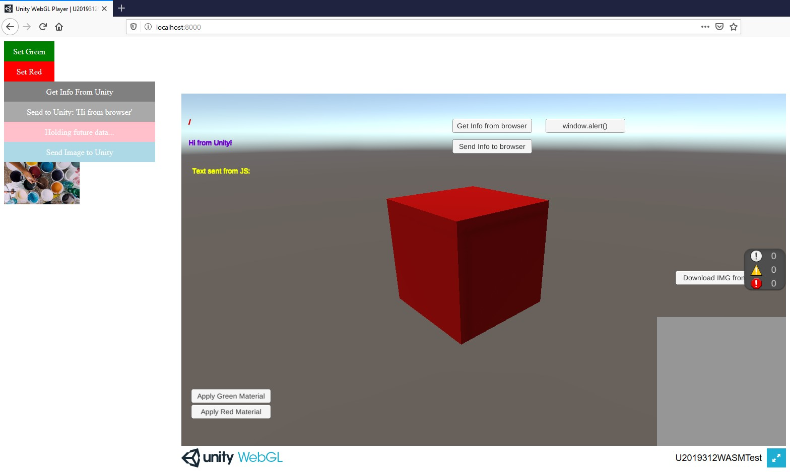

# Unity C# <-> JS Interop
Demo project implementing various mechanisms to exchange data and call functions between C# and JS.

The project showcase the following mechanisms:
- call JS from C#
- call C# from JS
- send data to C# from JS
- send data to JS from C#

The build creates the standard **index.html** file. There is an index_ref.html file in the Build folder, with the Javascript codes that is needed for this demo project.

**After build, you need to overwrite index.html file's content with index_ref.html content.**

In there **releases** of the Github project, you can find a zip containing only the content of the Build folder, that can be directly run.

To run the demo project, you need to start a local webserver.

For example, if you have Python 3 installed, you can go to the folder, start a console and type :
python -m http.server

You can then start a browser and go to http://localhost:8000

# Unity version
The project is built with Unity 2019.3.12f, on Windows 10.

It should work on OSX and Linux build, as well as Windows 8.

Previous Unity version should also work, providing they are exporting to WASM for web build.

# Dependencies
The project uses the **IngameDebugConsole** from https://github.com/yasirkula/UnityIngameDebugConsole